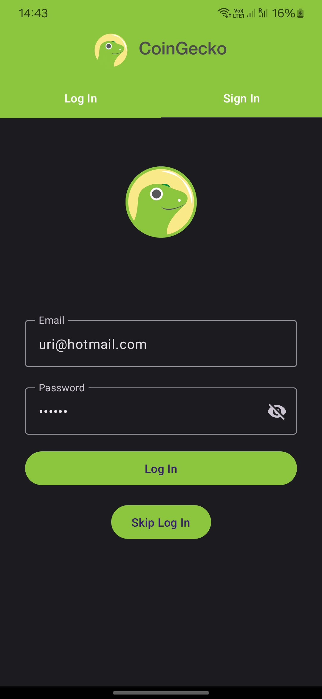
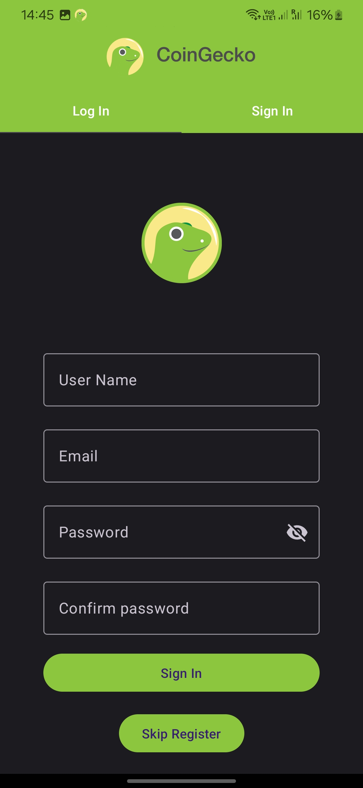

# Crypto Coin  📈

Crypto Coin is an Android application designed to monitor and track the information of 200 cryptocurrencies using the CoinGecko API. It leverages Firebase and Firestore to provide real-time updates and store user data securely.

## Features
- **Cryptocurrency Monitoring**: Access detailed information on 200 cryptocurrencies, including their descriptions, images, and current prices.
- **Favorites List**: Create and manage a personalized list of favorite cryptocurrencies for quick access.
- **Economic News Section**: Stay updated with the latest news and articles about the economy and cryptocurrencies.
- **Real-Time Updates**: Utilize Firebase Firestore to receive real-time updates on cryptocurrency prices and market trends.
- **User-Friendly Interface**: Enjoy a sleek and intuitive interface for seamless navigation and user experience.

## Screenshots

## Technologies Used
- **Android Development**: Kotlin, Jetpack, Android Studio
- **Firebase**: Firebase Authentication, Firestore
- **CoinGecko AP**I: For fetching cryptocurrency data
- **Dependency Injection**: Hilt
- **Database**: Room Database
